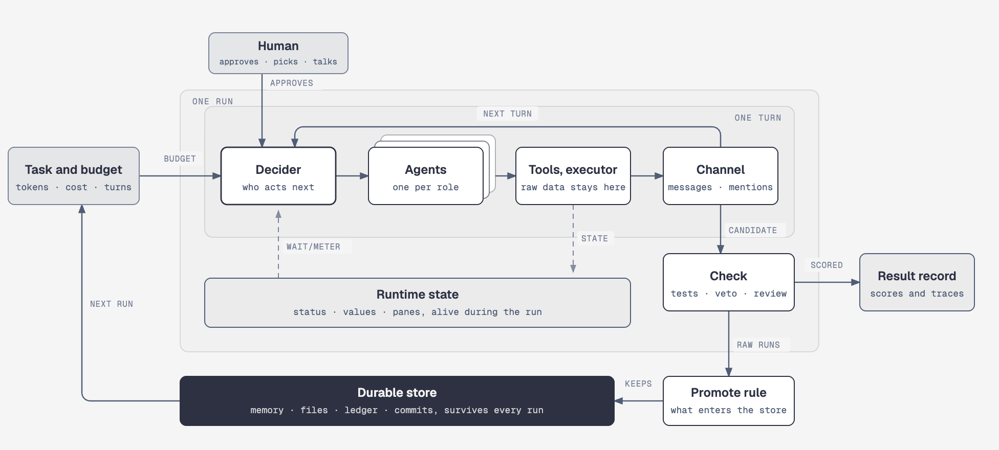
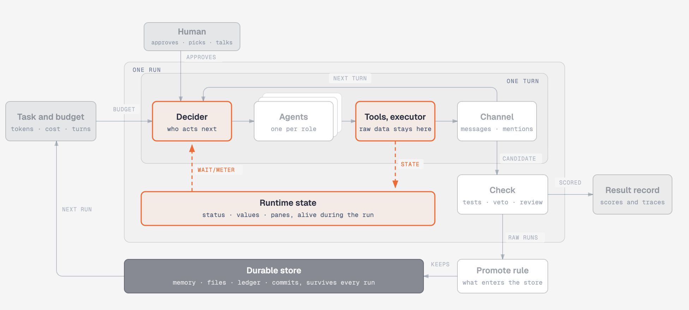
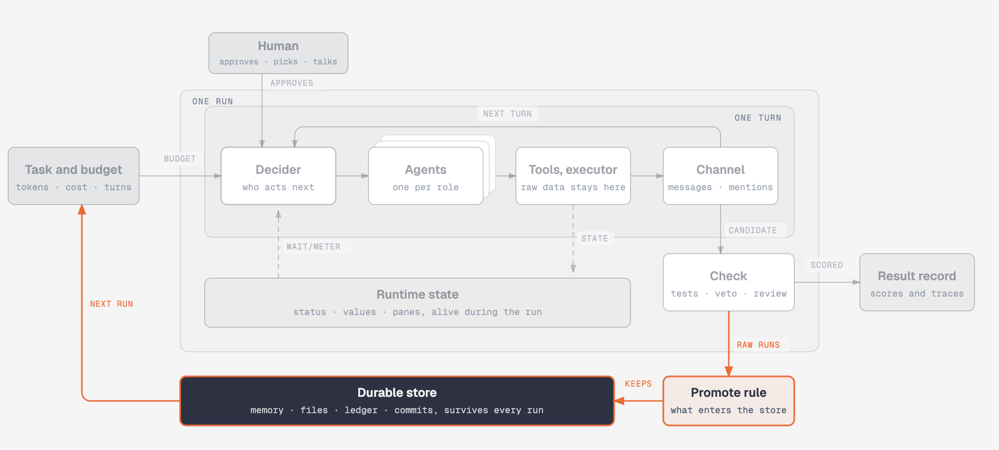
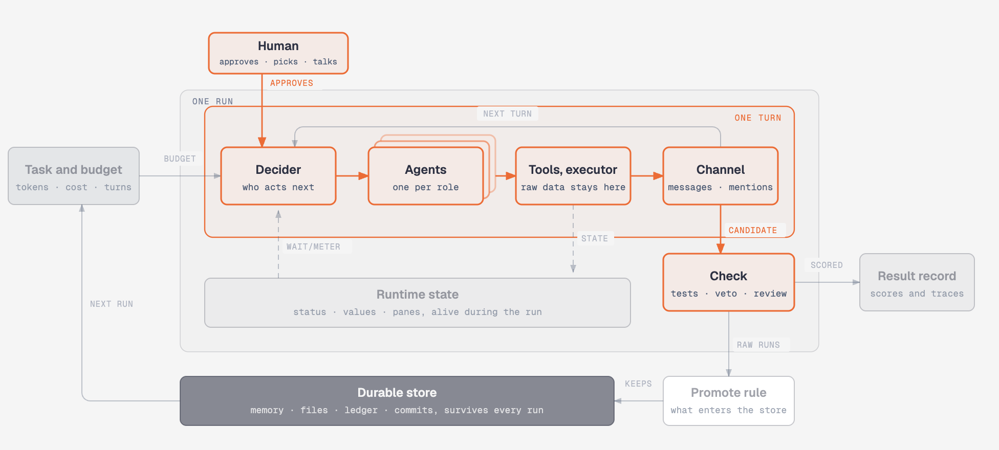
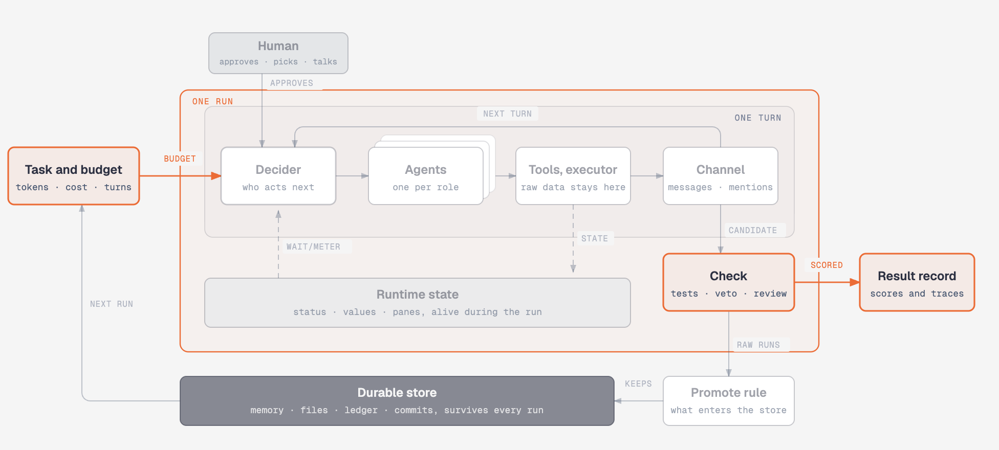

# Awesome Agent Coordination 

> Evidence-backed literature, techniques, protocols, tools, frameworks, repositories,
> and experimental workspaces for coordinating AI agents.

The central question is not whether several agents can be connected. It is **when
coordination improves a system, when it makes the system worse, and which mechanisms
explain the difference**.

This repository is practitioner-first and source-backed. Resources are organized by
the coordination problem they illuminate; papers and benchmarks sit beside the tools
and workspaces that implement those ideas.

## How to use this repository

- Start with a problem section and its **Technique lens**.
- Read **Current caveat** before selecting an architecture.
- Use `Essential`, `Strong`, and `Watch` as curation tiers, not popularity scores.
- Treat `Peer reviewed`, `Preprint`, `Documentation`, and related labels as evidence
  provenance; treat `Conceptual`, `Implemented`, `Evaluated`, and related labels as
  maturity.
- Follow the technique and secondary-theme tags to compare alternatives.
- Read [the editorial charter](EDITORIAL_CHARTER.md) for the inclusion rubric and
  maintenance policy.

## Contents

- [Structures the recent literature shares](#structures-the-recent-literature-shares)
- [Foundations and formal models](#foundations-and-formal-models)
- [Architectures and control topology](#architectures-and-control-topology)
- [Task decomposition, allocation, and delegation](#task-decomposition-allocation-and-delegation)
- [Communication and interoperability](#communication-and-interoperability)
- [State, memory, and durable execution](#state-memory-and-durable-execution)
- [Verification, recovery, and human oversight](#verification-recovery-and-human-oversight)
- [Incentives, safety, and governance](#incentives-safety-and-governance)
- [Evaluation, scaling, and economics](#evaluation-scaling-and-economics)
- [Contributing](#contributing)

## Structures the recent literature shares

The papers here from the second half of 2025 onward make one move in common. Coordination stops being something agents negotiate inside a conversation and becomes something held outside every model context, by a runtime, by a store, by a rule about whose output stands, or by the measurement around the run. One anatomy holds every part those papers use, and each of the four shapes below lights the parts it redesigns.

*A human sits above one run. Inside the run, one turn goes from the decider to one of several role agents, through tools, to the channel, and the posted message starts the next turn. A check gates what leaves the loop. The runtime-state band holds what lives outside every context during the run, the durable store below the run survives it, and the store seeds the next run.*

### 1. A runtime layer below the agents

Agents write status, values, and records into a runtime that holds them outside every context, and a script or harness reads that state to wait on an agent or to meter what it may spend.

- [herdr](https://github.com/herdrdev/herdr) keeps each coding agent in a persistent pane and lets a script block until an agent reports a status.
- [Prime Agent](https://arxiv.org/abs/2608.23552) keeps REPL values outside the context and carries prompts, memories, and skills to the next run through a versioned harness on disk.
- [VeRO](https://arxiv.org/abs/2602.22480) wraps the agent under improvement so every edit auto-commits and every evaluation decrements a fixed budget.

### 2. Replaceable agents around one durable store

Disposable agents produce raw runs, a promote rule decides what enters the store, and the store is the only thing that outlives them and seeds the next run.

- [Knowledge-Centric Self-Improvement](https://arxiv.org/abs/2607.19592) spawns a fresh agent per task and lets a distiller choose which claims seed the next generation.
- [Filesystem-Based Memory for LLM Agents](https://arxiv.org/abs/2607.26637) makes one markdown tree the sole shared state, written by a management agent and read by a search agent.
- [Trajectory](https://github.com/letta-ai/trajectory) normalizes any harness's transcript into one record that a later agent can read.
- [Always-On Agents](https://arxiv.org/abs/2606.30306) surveys 435 works and finds the field better at accumulating state than at governing it.

### 3. A role set under one asymmetry rule

Fixed or minted roles hand candidates to one rule that decides whose output stands, a veto, a price, or a rival offer, while raw data and control flow stay outside every role.

- [Team of Rivals](https://arxiv.org/abs/2601.14351) gives critics an outright veto and keeps raw data in a remote executor that returns summaries.
- [Economy of Minds](https://arxiv.org/abs/2606.02859) has no fixed roles at all, agents bid for the right to act and wealth decides who is copied or replaced.
- [Emergent Alignment via Competition](https://arxiv.org/abs/2509.15090) shows, in a model rather than a system, that a user choosing among rival agents can reach near-aligned outcomes.
- The expert arrangement in [The Illusion of Multi-Agent Advantage](https://arxiv.org/abs/2606.13003) puts the asymmetry between code and model, with plain Python holding control and arithmetic.

### 4. One budget, two arms, one scoreboard

One budget held outside every agent goes whole to a single agent and split across roles, with and without a validation step, and both arms land on the same record. The papers do not agree on what the budget is, a thinking-token cap, dollar cost, maximum iterations, or a fixed workload.

- [Tran and Kiela](https://arxiv.org/abs/2604.02460) match thinking tokens and find the single agent best or tied at every budget but the smallest.
- [CooperBench](https://arxiv.org/abs/2601.13295) matches the workload and finds two isolated peers retain roughly half of solo capability.
- [The Illusion of Multi-Agent Advantage](https://arxiv.org/abs/2606.13003) matches cost and finds six automated frameworks below chain-of-thought self-consistency.
- [Towards a Science of Scaling Agent Systems](https://arxiv.org/abs/2512.08296) matches compute across five topologies and measures errors amplifying 17.2 times without central verification against 4.4 times with it.

### Prior work

Entries from the first half of 2025 and earlier are best read by who decides the topology. Magentic-One, MetaGPT, and AutoGen put a runtime supervisor in the loop that picks the next speaker every turn. CAMEL, Mixture-of-Agents, and Multiagent Debate fix the arrangement by hand before anything runs. GPTSwarm hands the choice to an optimizer before deployment. Multi-Agent Collaboration via Evolving Orchestration (arXiv 2505.19591) trains the decider itself with reinforcement learning. Read against the shapes above, what changed is not that the decider got smarter but that the decision moved out of the conversation.

The catalog below is generated from `data/catalog.json`. Do not edit between the
markers; run `npm run generate` after changing catalog records.

<!-- CATALOG:START -->

## Foundations and formal models

**Technique lens:** Coordination starts with explicit models of shared goals, partial information, task allocation, communication, and joint decision-making.

**Current caveat:** Classical formalisms provide precise vocabulary, but their structured assumptions rarely transfer unchanged to open-ended language agents.

### Literature, standards, and evidence

- `Paper` `Essential` **[The Complexity of Decentralized Control of Markov Decision Processes](https://doi.org/10.1287/moor.27.4.819.297)** — Daniel S. Bernstein, Robert Givan, Neil Immerman, et al. · 2002 · Peer reviewed · Conceptual
  Formalizes decentralized partially observable decision processes and proves severe worst-case complexity for joint policy computation. **Why it matters:** Explains why decentralized coordination under partial information is structurally harder than solving independent single-agent problems.
  _Limitation: The formal state and observation models do not capture the open-ended semantics of modern language-agent environments._ `dec-pomdp` `peer-to-peer` `coordination-benchmarking` `theme:architectures` `theme:evaluation`

- `Paper` `Essential` **[Collaborative Plans for Complex Group Action](https://doi.org/10.1016/0004-3702(95)00103-4)** — Barbara J. Grosz, Sarit Kraus · 1996 · Peer reviewed · Conceptual
  Formalizes partial shared plans, intentions, commitments, and communication requirements for collaborative group action. **Why it matters:** Separates merely assigning subtasks from maintaining the mutual commitments and beliefs required for genuine teamwork.
  _Limitation: Its formal intentional model is difficult to instantiate faithfully in probabilistic language-model agents._ `joint-intentions` `task-decomposition` `human-in-the-loop` `theme:allocation` `theme:communication`

- `Paper` `Essential` **[A Blackboard Architecture for Control](https://doi.org/10.1016/0004-3702(85)90063-3)** — Barbara Hayes-Roth · 1985 · Peer reviewed · Conceptual
  Describes opportunistic coordination through a shared blackboard whose evolving state activates specialized knowledge sources. **Why it matters:** Provides the conceptual ancestor of shared-artifact and event-driven agent systems where coordination happens through durable state rather than chat alone.
  _Limitation: The architecture does not by itself solve distributed consistency, access control, or language-model reliability._ `blackboard` `shared-artifacts` `shared-memory` `theme:architectures` `theme:state`

- `Paper` `Essential` **[The Contract Net Protocol: High-Level Communication and Control in a Distributed Problem Solver](https://doi.org/10.1109/TC.1980.1675516)** — Reid G. Smith · 1980 · Peer reviewed · Conceptual
  Introduces announcement, bidding, award, and execution messages for decentralized task allocation among problem-solving nodes. **Why it matters:** Established a durable market-like delegation primitive that still clarifies manager-contractor and capability-based routing designs.
  _Limitation: Predates language-model agents and assumes structured tasks, messages, and locally meaningful bids._ `contract-net` `capability-delegation` `negotiation` `theme:allocation` `theme:communication`

- `Paper` `Strong` **[QMIX: Monotonic Value Function Factorisation for Deep Multi-Agent Reinforcement Learning](https://proceedings.mlr.press/v80/rashid18a.html)** — Tabish Rashid, Mikayel Samvelyan, Christian Schroeder de Witt, et al. · 2018 · Peer reviewed · Evaluated
  Factorizes a centralized action-value function into monotonic per-agent values that support decentralized action selection. **Why it matters:** Provides a canonical example of training with global coordination information while preserving decentralized execution at run time.
  _Limitation: Monotonic value factorization restricts the class of joint value functions and targets cooperative reinforcement-learning tasks rather than language agents._ `centralized-training-decentralized-execution` `hierarchical-control` `theme:architectures` `theme:evaluation`
  [Code](https://github.com/oxwhirl/pymarl)

- `Paper` `Strong` **[Learning to Communicate with Deep Multi-Agent Reinforcement Learning](https://papers.neurips.cc/paper/6042-learning-to-communicate-with-deep-multi-agent-reinforcement-learning)** — Jakob N. Foerster, Yannis M. Assael, Nando de Freitas, et al. · 2016 · Peer reviewed · Evaluated
  Introduces RIAL and DIAL, allowing agents to learn communication protocols under centralized learning and decentralized execution. **Why it matters:** Made the communication channel itself learnable and established a major bridge between multi-agent reinforcement learning and coordination design.
  _Limitation: Experiments use small synthetic environments and learned signals that do not directly transfer to open natural-language protocols._ `learned-communication` `centralized-training-decentralized-execution` `theme:communication` `theme:architectures`

## Architectures and control topology

**Technique lens:** Useful control patterns include independent ensembles, supervisor-worker teams, peer handoffs, hierarchies, graph workflows, and hybrid organizations.

**Current caveat:** No topology is universally best: architecture must match task decomposability, verification needs, tool pressure, and agent capability.

### Literature, standards, and evidence

- `Engineering Report` `Essential` **[Building Effective Agents](https://www.anthropic.com/engineering/building-effective-agents)** — Anthropic · 2024 · Official engineering · Implemented
  Distinguishes workflows from agents and describes routing, parallelization, orchestrator-workers, and evaluator-optimizer patterns. **Why it matters:** Offers a concise practical vocabulary and argues for adding agentic complexity only when simpler deterministic compositions stop working.
  _Limitation: It is first-party guidance rather than a controlled comparative study of the proposed patterns._ `dynamic-routing` `supervisor-worker` `verification-loop` `task-decomposition` `theme:allocation` `theme:verification`

- `Paper` `Essential` **[Improving Factuality and Reasoning in Language Models through Multiagent Debate](https://proceedings.mlr.press/v235/du24e.html)** — Yilun Du, Shuang Li, Antonio Torralba, et al. · 2024 · Peer reviewed · Evaluated
  Coordinates multiple language-model instances through iterative proposal, critique, and convergence to improve selected reasoning and factual tasks. **Why it matters:** Established the modern multi-agent debate pattern and a baseline for asking whether interaction adds value beyond independent sampling and voting.
  _Limitation: Benefits depend on task, diversity, and aggregation quality; correlated errors and consensus pressure can erase gains._ `debate` `voting` `verification-loop` `theme:verification` `theme:evaluation`

- `Paper` `Essential` **[AutoGen: Enabling Next-Gen LLM Applications via Multi-Agent Conversation](https://arxiv.org/abs/2308.08155)** — Qingyun Wu, Gagan Bansal, Jieyu Zhang, et al. · 2023 · Peer reviewed · Implemented
  Defines customizable conversable agents that combine models, tools, code, and humans through programmable multi-agent conversation patterns. **Why it matters:** Made multi-agent conversation a general software abstraction and enabled broad experimentation with topology, tool use, and human participation.
  _Limitation: The framework enables many patterns but does not identify which topology is correct for a given task._ `peer-to-peer` `supervisor-worker` `human-in-the-loop` `theme:communication` `theme:verification`
  [Code](https://github.com/microsoft/autogen)

- `Paper` `Strong` **[GPTSwarm: Language Agents as Optimizable Graphs](https://proceedings.mlr.press/v235/zhuge24a.html)** — Mingchen Zhuge, Wenyi Wang, Louis Kirsch, et al. · 2024 · Peer reviewed · Evaluated
  Represents agents and their information flow as a graph whose prompts and connectivity can be optimized for a task. **Why it matters:** Turns multi-agent topology from a hand-written diagram into an explicit, composable, and optimizable system design object.
  _Limitation: Optimization costs and benchmark-specific graph search can limit transfer to changing real-world environments._ `graph-workflow` `dynamic-routing` `sparse-communication` `theme:communication` `theme:evaluation`
  [Code](https://github.com/metauto-ai/GPTSwarm)

- `Paper` `Strong` **[Mixture-of-Agents Enhances Large Language Model Capabilities](https://arxiv.org/abs/2406.04692)** — Junlin Wang, Jue Wang, Ben Athiwaratkun, et al. · 2024 · Peer reviewed · Evaluated
  Uses layered sets of proposer models and aggregators so each layer refines responses using outputs from the previous layer. **Why it matters:** Provides a strong heterogeneous aggregation pattern and evidence that model diversity can matter more than repeated samples from one model.
  _Limitation: The layered ensemble primarily improves answer synthesis and does not address long-horizon action, shared state, or recovery._ `role-specialization` `voting` `verification-loop` `theme:verification` `theme:evaluation`
  [Code](https://github.com/togethercomputer/MoA)

- `Paper` `Strong` **[MetaGPT: Meta Programming for A Multi-Agent Collaborative Framework](https://arxiv.org/abs/2308.00352)** — Sirui Hong, Mingchen Zhuge, Jonathan Chen, et al. · 2023 · Peer reviewed · Evaluated
  Encodes software roles and standard operating procedures so agents exchange structured intermediate artifacts across a development workflow. **Why it matters:** Shows how explicit process constraints and typed deliverables can replace unconstrained chat with an auditable production line.
  _Limitation: Results are concentrated in software-generation tasks and depend strongly on prescribed roles and workflow artifacts._ `role-specialization` `shared-artifacts` `task-decomposition` `theme:allocation` `theme:state`
  [Code](https://github.com/geekan/MetaGPT)

- `Paper` `Strong` **[CAMEL: Communicative Agents for Mind Exploration of Large Scale Language Model Society](https://proceedings.neurips.cc/paper_files/paper/2023/hash/a3621ee907def47c1b952ade25c67698-Abstract-Conference.html)** — Guohao Li, Hasan Abed Al Kader Hammoud, Hani Itani, et al. · 2023 · Peer reviewed · Evaluated
  Uses role-playing and inception prompting to sustain cooperative interaction between language-model agents with assigned roles. **Why it matters:** Became an influential early template for role-conditioned LLM societies and for studying conversational cooperation at scale.
  _Limitation: Role-play quality and synthetic task completion do not establish reliability on consequential long-horizon work._ `role-specialization` `peer-to-peer` `capability-delegation` `theme:communication` `theme:allocation`
  [Code](https://github.com/camel-ai/camel)

### Tools, frameworks, and workspaces

- `Framework` `Strong` **[Microsoft Agent Framework](https://github.com/microsoft/agent-framework)** — Microsoft · 2026 · Documentation · Implemented
  Provides Python and .NET agents plus graph workflows for sequential, concurrent, handoff, group-chat, and Magentic orchestration with checkpoints and human interaction. **Why it matters:** Is the supported convergence path for AutoGen and Semantic Kernel and exposes a broad set of explicit orchestration patterns for production use.
  _Limitation: A broad supported feature set is not evidence that one included orchestration pattern outperforms alternatives for a particular task._ `graph-workflow` `supervisor-worker` `durable-execution` `human-in-the-loop` `theme:state` `theme:verification` `theme:communication`
  [Docs](https://learn.microsoft.com/agent-framework/)

- `Framework` `Strong` **[OpenAI Agents SDK](https://github.com/openai/openai-agents-python)** — OpenAI · 2025 · Documentation · Implemented
  Provides manager-style agents-as-tools, peer handoffs, guardrails, sessions, tracing, approvals, parallel execution, and protocol integration in a compact SDK. **Why it matters:** Clearly separates manager-controlled delegation from peer ownership transfer and offers a small implementation surface for comparing those orchestration choices.
  _Limitation: The SDK documents coordination primitives but does not establish that model-driven handoffs or managers are optimal for a given workload._ `supervisor-worker` `peer-to-peer` `capability-delegation` `human-in-the-loop` `theme:allocation` `theme:verification` `theme:communication`
  [Docs](https://openai.github.io/openai-agents-python/multi_agent/)

## Task decomposition, allocation, and delegation

**Technique lens:** Decomposition and delegation turn a goal into owned work through plans, routing, capability matching, bidding, or dynamic team formation.

**Current caveat:** Delegation adds value only when subtasks are sufficiently independent and the orchestrator preserves dependencies, context, and responsibility.

### Literature, standards, and evidence

- `Engineering Report` `Essential` **[How We Built Our Multi-Agent Research System](https://www.anthropic.com/engineering/multi-agent-research-system)** — Anthropic · 2025 · Official engineering · Deployed
  Describes a lead research agent delegating parallel searches to subagents with isolated contexts, tracing, synthesis, and production deployment constraints. **Why it matters:** Provides rare implementation detail on delegation prompts, breadth-first parallelism, context boundaries, token economics, observability, and synchronous bottlenecks.
  _Limitation: Reported performance gains come from an internal evaluation and the system uses substantially more tokens than a single chat agent._ `supervisor-worker` `task-decomposition` `capability-delegation` `matched-compute-evaluation` `theme:architectures` `theme:state` `theme:evaluation`

- `Paper` `Essential` **[Magentic-One: A Generalist Multi-Agent System for Solving Complex Tasks](https://arxiv.org/abs/2411.04468)** — Adam Fourney, Gagan Bansal, Hussein Mozannar, et al. · 2024 · Preprint · Evaluated
  Uses an orchestrator with task and progress ledgers to plan, delegate to tool-specialized agents, monitor progress, and replan after errors. **Why it matters:** Supplies a concrete supervisor-worker reference architecture with explicit working memory, recovery behavior, modular specialists, and benchmark evidence.
  _Limitation: Competitive benchmark performance remains far from human reliability and does not isolate every contribution of the orchestration design._ `supervisor-worker` `task-decomposition` `replanning` `shared-memory` `theme:architectures` `theme:state` `theme:verification`
  [Code](https://github.com/microsoft/autogen/blob/main/python/packages/autogen-ext/src/autogen_ext/teams/magentic_one.py)

- `Paper` `Strong` **[Multi-Agent Collaboration via Evolving Orchestration](https://arxiv.org/abs/2505.19591)** — Yufan Dang, Chen Qian, Xueheng Luo, et al. · 2025 · Peer reviewed · Evaluated
  Trains a central orchestrator with reinforcement learning to choose which agent acts next as the task state changes, instead of fixing the team structure before the run. **Why it matters:** Attributes its performance and cost gains to compact cyclic reasoning structures that emerge as the orchestrator evolves rather than to adding agents or a stronger model.
  _Limitation: Reported cost savings cover inference and exclude the reinforcement learning run that trains the orchestrator, which also concentrates every routing decision in one component._ `dynamic-routing` `supervisor-worker` `task-decomposition` `hierarchical-control` `theme:architectures` `theme:evaluation`
  [Code](https://github.com/OpenBMB/ChatDev/tree/puppeteer)

## Communication and interoperability

**Technique lens:** Agents coordinate through messages, shared artifacts, capability discovery, communication graphs, and protocols such as FIPA ACL, A2A, and MCP.

**Current caveat:** More communication can increase cost, consensus pressure, and error propagation without improving distributed reasoning or interoperability semantics.

### Literature, standards, and evidence

- `Specification` `Essential` **[Agent2Agent Protocol Specification](https://a2a-protocol.org/latest/specification/)** — A2A Protocol Project · 2025 · Official specification · Implemented
  Defines discovery, agent cards, messages, collaborative task lifecycle, streaming, push notifications, authentication declarations, and version negotiation for opaque remote agents. **Why it matters:** Provides the first stable, broadly supported open contract aimed specifically at cross-vendor agent-to-agent interoperability rather than tool invocation.
  _Limitation: The protocol transports collaborative tasks but does not choose topology, allocation, verification, or recovery policy for an agent team._ `interoperability` `identity-and-trust` `capability-delegation` `theme:state` `theme:governance`
  [Code](https://github.com/a2aproject/A2A) · [Spec](https://github.com/a2aproject/A2A/blob/main/docs/specification.md)

- `Specification` `Essential` **[Model Context Protocol Specification](https://modelcontextprotocol.io/specification/latest)** — Model Context Protocol Project · 2024 · Official specification · Deployed
  Standardizes how agentic applications connect to tools, resources, prompts, context providers, and long-running task extensions through negotiated capabilities. **Why it matters:** Creates a composable tool and context boundary that complements A2A and materially shapes how coordinated agents share external capabilities.
  _Limitation: MCP standardizes tool and context integration; it is not a general peer-agent coordination protocol or orchestration strategy._ `interoperability` `capability-delegation` `least-privilege` `theme:state` `theme:governance`

- `Specification` `Essential` **[FIPA Agent Communication Language Specifications](https://www.fipa.org/repository/aclspecs.html)** — Foundation for Intelligent Physical Agents · 2002 · Historical standard · Implemented
  Standardizes communicative acts, message structure, conversation identifiers, content languages, and interaction protocols for heterogeneous agents. **Why it matters:** Supplies the historical standards baseline for performatives, directories, Contract Net, auctions, and semantically explicit agent messages.
  _Limitation: Formal mental-state semantics proved difficult to verify and the specifications predate current web-native agent protocols._ `interoperability` `contract-net` `negotiation` `theme:foundations` `theme:allocation`

## State, memory, and durable execution

**Technique lens:** Reliable teams externalize progress into typed artifacts, shared state, checkpoints, provenance, and durable workflow history instead of relying on conversational recall.

**Current caveat:** Shared memory introduces ordinary distributed-systems problems: consistency, ownership, idempotency, conflict resolution, privacy, and recovery.

### Tools, frameworks, and workspaces

- `Experimental Workspace` `Strong` **[Building a C Compiler with a Team of Parallel Claudes](https://www.anthropic.com/engineering/building-c-compiler)** — Anthropic · 2026 · Official engineering · Experimental
  Runs a long-lived team of coding agents through isolated workspaces, shared task locks, Git synchronization, specialist roles, and decomposed tests. **Why it matters:** Exposes concrete coordination artifacts and failure modes from a large experimental build instead of presenting only a framework API or short benchmark run.
  _Limitation: This is a first-party case study on one codebase and agent family, not a controlled general comparison of coordination strategies._ `shared-artifacts` `durable-execution` `task-decomposition` `verification-loop` `theme:allocation` `theme:verification` `theme:evaluation`

- `Framework` `Strong` **[LangGraph](https://github.com/langchain-ai/langgraph)** — LangChain · 2024 · Documentation · Implemented
  Builds stateful agent systems as explicit graphs with shared state, reducers, subgraphs, checkpoints, interrupts, streaming, and durable execution. **Why it matters:** Makes control flow and state transitions inspectable while supporting both deterministic workflows and agent-driven branching in long-running systems.
  _Limitation: Framework primitives improve control and persistence but do not automatically produce effective decomposition, routing, or verification policies._ `graph-workflow` `shared-memory` `durable-execution` `human-in-the-loop` `theme:architectures` `theme:verification`
  [Docs](https://docs.langchain.com/oss/python/langgraph/overview)

- `Tool` `Watch` **[herdr](https://github.com/herdrdev/herdr)** — Herdr · 2026 · Documentation · Implemented
  Runs each coding agent in a persistent pane on a background server and exposes a socket API for opening panes, sending input to another agent, and waiting until an agent reports a given status. **Why it matters:** Moves session persistence and agent status into the runtime below the agent, so idle, working, and blocked become states another agent or a script can wait on across several agent CLIs.
  _Limitation: Panes exchange raw terminal input rather than structured messages, and the documentation reports no comparison against coordinating the same agents through a framework or a shell._ `durable-execution` `peer-to-peer` `human-in-the-loop` `theme:architectures` `theme:verification`
  [Docs](https://herdr.dev/docs/)

## Verification, recovery, and human oversight

**Technique lens:** Verification loops, explicit stop conditions, replanning, approvals, and independent reviewers contain compounding errors and support recovery.

**Current caveat:** A verifier powered by the same correlated model family can reproduce the team’s mistakes, so process metrics and external checks remain necessary.

### Literature, standards, and evidence

- `Paper` `Essential` **[Why Do Multi-Agent LLM Systems Fail?](https://arxiv.org/abs/2503.13657)** — Mert Cemri, Melissa Z. Pan, Shuyi Yang, et al. · 2025 · Preprint · Evaluated
  Derives MAST, a taxonomy of fourteen multi-agent failure modes across system design, inter-agent misalignment, and verification or termination. **Why it matters:** Grounds failure analysis in more than 1,600 traces across multiple systems and shows that aggregate success hides distinct architectural failure profiles.
  _Limitation: Failure labels and interventions cover a selected set of frameworks and tasks and do not prove the taxonomy is exhaustive._ `failure-analysis` `verification-loop` `replanning` `theme:architectures` `theme:evaluation`

- `Paper` `Watch` **[If You Want Coherence, Orchestrate a Team of Rivals: Multi-Agent Models of Organizational Intelligence](https://arxiv.org/abs/2601.14351)** — Gopal Vijayaraghavan, Prasanth Jayachandran, Arun Murthy, et al. · 2026 · Preprint · Deployed
  Splits work across planner, executor, and critic roles where a critic can veto an output outright, and routes tool calls through a remote executor that returns summaries rather than raw data. **Why it matters:** Replaces majority voting with hierarchical veto authority and reports catching more than ninety percent of internal errors before they reach a user in a running system of over fifty agents.
  _Limitation: The interception rate comes from the authors' own production traces rather than a public benchmark, and no matched-compute or single-agent baseline is reported for the same workload._ `verification-loop` `role-specialization` `hierarchical-control` `sparse-communication` `theme:architectures` `theme:communication`

## Incentives, safety, and governance

**Technique lens:** Coordination changes incentives and authority: systems need identity, least privilege, negotiation rules, audit trails, anti-collusion measures, and commit-time controls.

**Current caveat:** Individually aligned agents can still miscoordinate, conflict, collude, or amplify attacks when deployed as an interacting population.

### Literature, standards, and evidence

- `Paper` `Essential` **[Multi-Agent Risks from Advanced AI](https://arxiv.org/abs/2502.14143)** — Cooperative AI Foundation · 2025 · Preprint · Conceptual
  Organizes advanced multi-agent risks around miscoordination, conflict, and collusion plus seven underlying structural risk factors. **Why it matters:** Provides a broad risk taxonomy connecting incentives, information asymmetry, network effects, commitment, emergent agency, and security.
  _Limitation: The report synthesizes heterogeneous evidence and forward-looking scenarios rather than validating one complete mitigation stack._ `mechanism-design` `identity-and-trust` `failure-analysis` `theme:communication` `theme:evaluation`

- `Talk` `Watch` **[When Millions of AI Agents Meet](https://www.youtube.com/watch?v=V04bm-3d6EQ)** — Nenad Tomašev, Hannah Fry · 2026 · Primary source talk · Conceptual
  Explores societies of specialist and generalist agents that delegate, negotiate, transact, and self-coordinate alongside trust, reliability, and safety challenges. **Why it matters:** Connects orchestration to agent economies, correlated failures, collusion, security, specialist certification, and distributed alignment in an accessible expert discussion.
  _Limitation: This is an expert interview rather than peer-reviewed empirical evidence, and several claims are forward-looking._ `role-specialization` `negotiation` `identity-and-trust` `mechanism-design` `theme:architectures` `theme:allocation`

## Evaluation, scaling, and economics

**Technique lens:** Credible evaluation measures outcome, coordination process, token and message cost, latency, variance, failure attribution, and matched-compute single-agent baselines.

**Current caveat:** Agent count is test-time compute, not free capability; recent evidence shows large gains on decomposable work and severe losses on sequential tasks.

### Literature, standards, and evidence

- `Benchmark` `Essential` **[SILO-BENCH: A Scalable Environment for Evaluating Distributed Coordination in Multi-Agent LLM Systems](https://aclanthology.org/2026.acl-long.1354/)** — Yuzhe Zhang, Feiran Liu, Yi Shan, et al. · 2026 · Peer reviewed · Evaluated
  Evaluates role-free collaboration under information silos across communication-complexity levels, protocols, agent scales, and frontier models. **Why it matters:** Reveals a communication-reasoning gap: agents exchange information actively yet fail to integrate distributed state, with performance collapsing at larger scales.
  _Limitation: Algorithmic information-silo tasks isolate coordination cleanly but do not represent every semantic or tool-mediated production workflow._ `coordination-benchmarking` `sparse-communication` `shared-memory` `failure-analysis` `theme:communication` `theme:state`
  [Code](https://github.com/jwyjohn/acl26-silo-bench)

- `Paper` `Essential` **[Towards a Science of Scaling Agent Systems](https://arxiv.org/abs/2512.08296)** — Yubin Kim, Ken Gu, Chanwoo Park, et al. · 2025 · Preprint · Evaluated
  Compares 260 controlled agent configurations across single, independent, centralized, decentralized, and hybrid architectures with standardized compute and tools. **Why it matters:** Finds architecture-task alignment dominates agent count: decomposable work improves substantially while sequential planning can degrade sharply, and central verification contains errors better.
  _Limitation: The predictive model explains only part of performance variance and its architecture preferences require validation on further tasks and systems._ `matched-compute-evaluation` `coordination-benchmarking` `supervisor-worker` `failure-analysis` `theme:architectures` `theme:verification`

- `Benchmark` `Essential` **[MultiAgentBench: Evaluating the Collaboration and Competition of LLM Agents](https://aclanthology.org/2025.acl-long.421/)** — Kunlun Zhu, Hongyi Du, Zhaochen Hong, et al. · 2025 · Peer reviewed · Evaluated
  Evaluates collaboration and competition across six interactive scenarios, milestone metrics, multiple reasoning strategies, and star, chain, tree, and graph topologies. **Why it matters:** Moves beyond final accuracy by measuring coordination progress and comparing explicit communication structures in interactive environments.
  _Limitation: Scenario and model choices remain narrower than production environments, and topology results are not universal prescriptions._ `coordination-benchmarking` `graph-workflow` `matched-compute-evaluation` `theme:architectures` `theme:communication`
  [Code](https://github.com/MultiagentBench/MARBLE)

- `Paper` `Essential` **[AI Agents That Matter](https://arxiv.org/abs/2407.01502)** — Sayash Kapoor, Benedikt Stroebl, Zachary S. Siegel, et al. · 2024 · Peer reviewed · Evaluated
  Critiques agent benchmarks that ignore cost, overfit weak holdouts, conflate developer needs, and use non-reproducible evaluation practices. **Why it matters:** Establishes cost-accuracy Pareto analysis, standardized evaluation, and held-out generalization as prerequisites for credible agent claims.
  _Limitation: The analysis targets agent evaluation broadly and does not isolate every coordination-specific metric needed for multi-agent systems._ `matched-compute-evaluation` `coordination-benchmarking` `failure-analysis` `theme:verification`
  [Project](https://agents.cs.princeton.edu/)

- `Benchmark` `Strong` **[LLM-Coordination: Evaluating and Analyzing Multi-Agent Coordination Abilities in Large Language Models](https://aclanthology.org/2025.findings-naacl.448/)** — Saaket Agashe, Yue Fan, Anthony Reyna, et al. · 2025 · Peer reviewed · Evaluated
  Tests agentic coordination and question answering in pure coordination games requiring environment comprehension, partner modeling, and joint planning. **Why it matters:** Isolates coordination ability from broad tool-use competence and reveals particular weakness when success requires reasoning about a partner’s beliefs.
  _Limitation: Pure coordination games are controlled and interpretable but only approximate open-ended organizational coordination._ `coordination-benchmarking` `joint-intentions` `dec-pomdp` `theme:foundations` `theme:communication`

<!-- CATALOG:END -->

## Contributing

See [CONTRIBUTING.md](CONTRIBUTING.md). Every entry must link to a primary artifact,
state its coordination contribution and notability, and record a material limitation.

The catalog is validated with `npm test` and `npm run validate`; generated README,
freshness, and link checks are also available through the package scripts.

